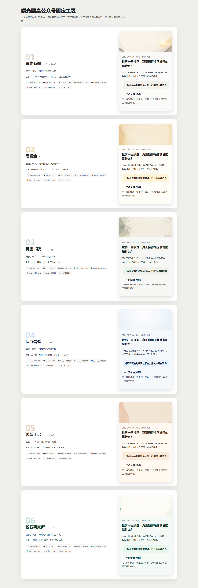

# 曙光圆桌写作会议

一个面向 Codex 的公开写作 Skill。它把“想写点什么”变成一套可核查、可修改、能交付的写作流程，并把选题、研究、结构、写作、事实核查、读者审稿和平台排版组织在同一张圆桌上。



## 大白话说明

你可以把它理解成一位总编带着一组写作工序工作：先弄清楚文章写给谁、要解决什么，再决定要不要查资料、怎样搭结构、哪些事实必须核验，最后根据公众号、短视频或普通文章的要求交付成品。

它不是简单“帮你润色”，也不会为了显得专业而自动跑完整流程。你只要改开头，它就只处理开头；你只要核查事实，它就不擅自改写观点；任务清楚时会直接成稿。

## 能做什么

- 从模糊想法完成选题、研究、提纲和长文。
- 把零散素材或已有草稿改成可发布内容。
- 单独调用选题、证据研究、风格画像、事实核查、读者审稿或平台改写。
- 局部修改并保护已经确认、不允许改动的内容。
- 生成知识型微信公众号长文、粘贴版 HTML 和手机预览。
- 自动选择六套公众号主题：曙光石墨、晨曦金、青墨书院、深海智蓝、暖纸手记、松石研究所。
- 使用附带的校验脚本检查案卷、局部修订、真实交付文件和公众号 HTML。

## 输入与输出

可以输入一个想法、提纲、Markdown、已有稿件、合法可用的本地材料或网页链接。

根据任务输出成稿、圆桌决议、证据与待确认项、修改说明，以及用户实际需要的平台文件。公众号公开终稿默认不在文末堆参考资料，但内部证据台账仍会保留来源；高风险内容或用户明确要求时可以公开来源。

## 安装

### 方法一：下载 ZIP

1. 在 GitHub 页面点击 `Code` → `Download ZIP`。
2. 解压后找到 `skill/shuguang-writing-roundtable`。
3. 把整个文件夹复制到 Codex Skills 目录：
   - Windows：`%USERPROFILE%\.codex\skills\shuguang-writing-roundtable`
   - macOS/Linux：`~/.codex/skills/shuguang-writing-roundtable`
4. 新开一个 Codex 任务，让 Skill 被重新发现。

### 方法二：Git 克隆

```powershell
git clone https://github.com/2282199198/shuguang-writing-roundtable.git
Copy-Item -Recurse -Force ".\shuguang-writing-roundtable\skill\shuguang-writing-roundtable" "$env:USERPROFILE\.codex\skills\shuguang-writing-roundtable"
```

macOS/Linux：

```bash
git clone https://github.com/2282199198/shuguang-writing-roundtable.git
cp -R ./shuguang-writing-roundtable/skill/shuguang-writing-roundtable ~/.codex/skills/
```

## 怎么调用

安装后新开一个 Codex 任务，可以用三种方式：

- **最确定**：输入 `$shuguang-writing-roundtable`，后面直接写任务。
- **直接点名**：说“使用曙光圆桌写作会议”“召开圆桌写作会议”或“让写作专家团处理”。
- **自然语言触发**：直接说“写知识型公众号长文”“核查这篇文章的事实”“只改开头”或“生成公众号粘贴版”。Skill 已明确开启隐式调用，不要求背诵固定口令。

可以直接复制：

- “`$shuguang-writing-roundtable` 把这个想法写成有知识增量的公众号长文，主题和结构由你决定。”
- “只开事实编辑席，核查这篇文章里的数字和结论。”
- “保留第二、三部分，只重写开头。”
- “分析这些合法样文，建立一份可编辑的写作画像。”
- “把这篇文章排成公众号最终版，主题你来选。”

常用触发词包括：`曙光圆桌写作会议`、`圆桌写作`、`写作专家团`、`公众号长文`、`知识型长文`、`深度文章`、`定选题`、`搭大纲`、`找论据`、`事实核查`、`证据审计`、`审稿`、`局部改稿`、`公众号排版`、`微信粘贴版`、`手机预览`。系统按完整意图判断，不会因为普通对话里偶然出现“写作”两个字就机械启动完整流程。

## 公众号主题

主题目录位于 `skill/shuguang-writing-roundtable/assets/wechat-themes/`。七张背景图片已经随仓库提供，不需要联网生成；需要重新设计时，目录中也保留了 Image 2.0 提示词。

背景图片只是封面、开篇横幅或章节分隔的增强层。真实发布前仍应把采用的图片上传到公众号素材库；即使删除背景，正文结构也必须保持完整。

## 本地验证

全部脚本只依赖 Python 标准库。建议使用 Python 3.10 或更高版本：

```powershell
python -X utf8 -m unittest discover -s tests -v
python -X utf8 skill/shuguang-writing-roundtable/scripts/validate_theme_catalog.py
```

## 已验证范围

- Skill 结构快速校验通过。
- 公开包独立测试通过。
- 六套主题与七张背景资产通过目录和图片检查。
- 微信兼容 HTML 通过两套机器校验。
- 使用真实知识型长文完成从成稿到公众号粘贴的人工验收。

这些结果证明当前工作流和交付链路可用，不代表所有题材都能自动达到相同质量。医学、法律、金融、政策、新闻等高影响内容仍需当前权威来源与人工判断。

## 重要边界

- 本项目是原创、非官方实现，与“得到”或“得到大脑”没有隶属、合作、兼容认证或授权关系。
- 仓库不包含任何专有系统提示词、课程、听书、电子书、账号能力、私人笔记或用户稿件。
- 不会自动登录平台、上传资料、发布文章或调用付费服务。
- 其他 Agent 宿主可能使用不同的 Skill 目录、前置元数据和 HTML 规则，需要自行适配；当前公开验收以 Codex 为准。

## 许可证

本项目采用 [MIT License](LICENSE)。设计来源与第三方启发说明见 Skill 内的 `references/provenance-and-limits.md`。
